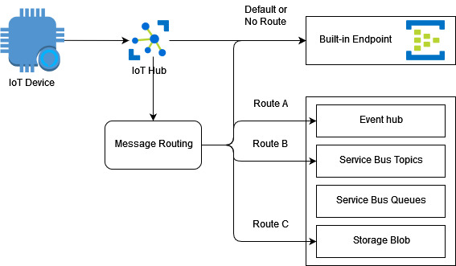

# iot-hub-dps-509cert
The idea here is to deploy iot-devices at scale using Azure Device Provisioning Service (DPS). The following topics are covered

1. Individual Device Enrollments procedure with DPS.
2. Group Device Enrollments procedures with DPS. 
3. Send telemetry data from provisioned iot devices to azure iot hub.
4. Receieve telemetry data using built-in endpoint in iothub.
5. Receieve telemetry data using custom endpoint (message routing). 

## Conceptual model - IoT Hub Message Routing

## DPS Group Enrollment

### create test certificates
Microsoft docs for details - https://docs.microsoft.com/en-us/azure/iot-hub/tutorial-x509-openssl

Find the demo client from Microsoft - https://github.com/MicrosoftLearning/MSLearnLabs-AZ-220-Microsoft-Azure-IoT-Developer/blob/master/Allfiles/Labs/06-Automatic%20Enrollment%20of%20Devices%20in%20DPS/Final/ContainerDevice/Program.cs

### way 1 (the way I did it):
Minimul docs - https://github.com/dotnet/samples/blob/main/iot/dotnet-iot-and-nanoframework/create-certificate.md
1. Create a root certificate using a root CA configuraiton file.
2. Upload the certificate in DPS.
3. Domonstrate proof of possession in DPS.
4. Create a client device certificate using the same root CA configuration file.

### way 2:
Download the following files from https://github.com/Azure/azure-iot-sdk-c/tree/main/tools/CACertificates
1. certGen.sh, 
2. openssl_root_ca.cnf, 
3. and openssl_device_intermediate_ca.cnf 

Then follow - https://github.com/Azure/azure-iot-sdk-c/blob/main/tools/CACertificates/CACertificateOverview.md

## DPS Individual Enrollment
todo.

## TempSimulator
I added a dummy temperature simulator built in .net core 3.1. 
Add properties in key value pair while sending the telemetry data. Add Message Routing rule in azure iot-hub according to those key value pair.

## Function App
There are two functions apps 
1. Built-in-endpoint - Listening to default iot-hub.
2. Blob-endpoint - Listening to blob storage for those messages that were routed to blob container.

